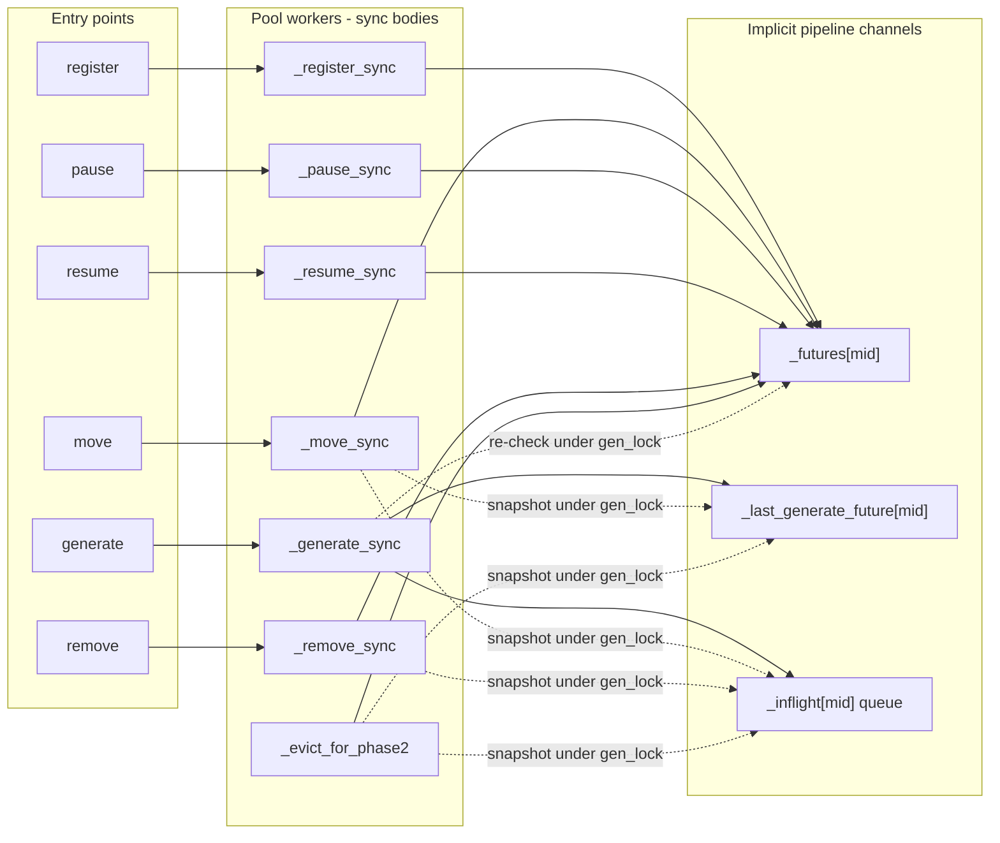
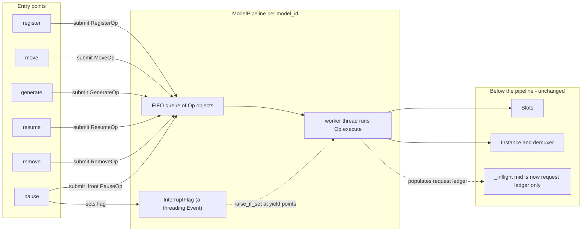
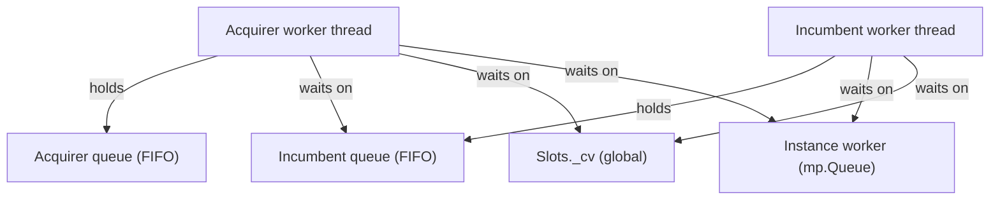
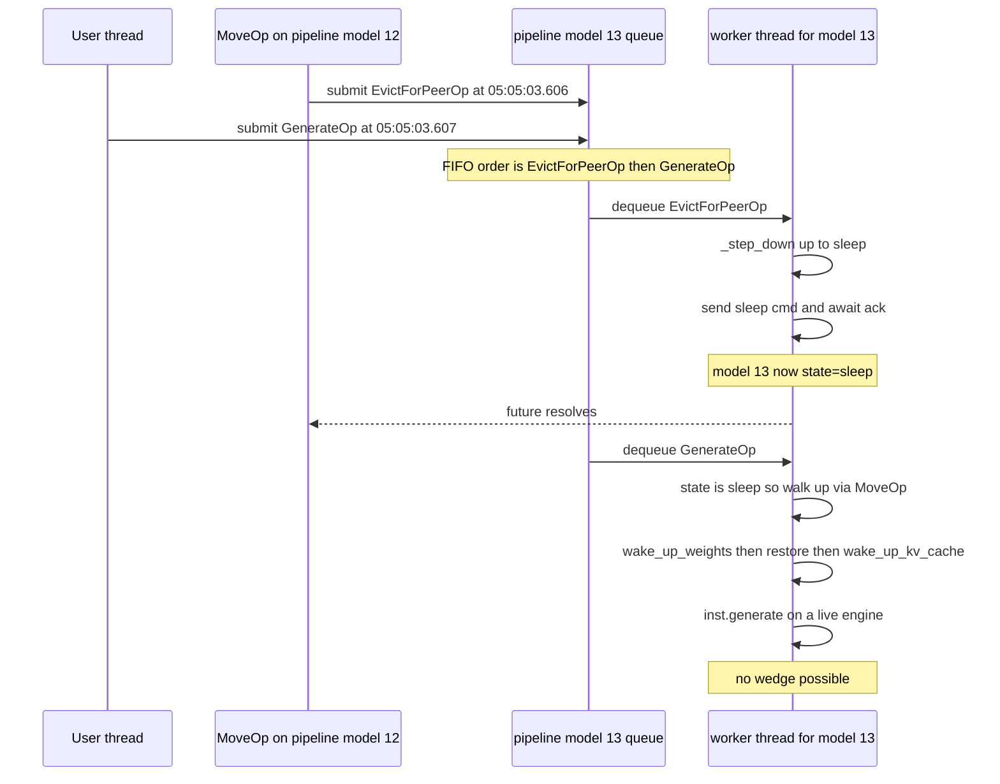

# Per-Model Pipeline -- Design

A proposal to replace the orchestrator's implicit per-model operation
pipeline (built out of `_futures[mid]`, `_last_generate_future[mid]`,
`_inflight[mid]`, and per-call-site snapshotting under `gen_lock`)
with an **explicit** `ModelPipeline` object per `model_id`, plus an
`InterruptFlag` to model pause-as-interrupt as a structural property
instead of a per-call-site discipline.

> **Naming note.** `InterruptFlag` is a synchronisation primitive --
> a wrapped `threading.Event`. It has **nothing to do with LLM
> tokens** (token_ids, tokenizer output, tokens/sec); the conventional
> .NET-style name "CancellationToken" was deliberately avoided to
> prevent that overload. Its sole job is to interrupt **the
> pipeline worker's wait inside `Op.execute()`**, not to cancel the
> user's request. See section 5.0 for the user-facing semantics of
> pause -- the user's generation is paused-and-resumed, not
> destroyed.

> **Status:** design only. No code changes are proposed in this
> document; a follow-up implementation plan will be written after
> review.

This document assumes familiarity with [orchestrator_DESIGN.md](orchestrator_DESIGN.md)
(especially the **State Machine**, **Slot Allocation**, and
**Known Issues** sections) and the comment blocks in [orchestrator.py](orchestrator.py).
Most of what is proposed here is a structural re-framing of mechanisms
that already exist; the goal is to make the existing pipeline an
object instead of a discipline.

---

## 1. Motivation: the implicit pipeline today

Every entry point on `Orchestrator` (`register`, `move`, `generate`,
`pause`, `resume`, `remove`) submits a `_*_sync` callable to a shared
`ThreadPoolExecutor` (`_pool`, sized to 4096 workers in [orchestrator.py:448](orchestrator.py))
and stashes the returned `Future` somewhere. There is no single
"pipeline" object: there are three loosely coupled per-`model_id`
channels that together encode "what is happening on this model right
now":

| Channel | What it tracks | Mutated by |
|---|---|---|
| `_futures[mid]` | The most recent non-generate op (`register`/`move`/`pause`/`resume`/`remove`/eviction sentinel) | Every entry point except `generate`; also `_evict_for_phase2` publishes a sentinel here |
| `_last_generate_future[mid]` | The most recent `_generate_sync` Future | `submit_generate` / `generate` |
| `_inflight[mid]` | List of `(req_id, q_rec, done_event)` for requests currently inside the engine | `_generate_sync` Phase 2 (append), demuxer `_on_generate_done` (pop + set event) |



There is a logical FIFO of operations per model, but it is built out
of those three channels plus per-call-site discipline -- every
non-generate caller has to remember to:

1. Snapshot the prior `_futures[mid]` (their predecessor).
2. Acquire `gen_lock` (`_get_generate_lock(mid)`).
3. Snapshot `_last_generate_future[mid]` and the per-request
   `done_event`s out of `_inflight[mid]`.
4. Release `gen_lock`.
5. Submit `_*_sync` and pass the three snapshots in so the body can
   `_await_prev` on each.

That same discipline shows up at every call site, each with slightly
different rules:

- `move` at [orchestrator.py:820-907](orchestrator.py) -- snapshots
  `prev`, `prev_gen_future`, `prev_gen_events`, passes all three into
  `_move_sync`.
- `_evict_for_phase2` at [orchestrator.py:200-300](orchestrator.py) --
  snapshots `prev_chain_future`, `prev_gen_future`,
  `prev_inflight_events`, then publishes its own sentinel `Future`
  onto `_futures[mid]` under `gen_lock`.
- `_drain_inflight_generates` at [orchestrator.py:134-198](orchestrator.py)
  -- re-snapshots `_last_generate_future[mid]` and `_inflight[mid]`
  events.
- `remove` at [orchestrator.py:2300-2360](orchestrator.py) -- snapshots
  `prev` and `prev_gen_events`.
- `_generate_sync` sentinel re-check loop at
  [orchestrator.py:1625-1739](orchestrator.py) -- re-fetches
  `_futures[mid]` under `gen_lock` against its submit-time snapshot
  and loops if a sentinel was published in the gap.

In addition, four bodies (`_move_sync`, `_drain_inflight_generates`,
`_evict_for_phase2`, and the `_generate_sync` sentinel loop) carry
the same `while not ev.wait(timeout=0.5): if entry.get("paused"):
break` polling shape, because a blind `ev.wait()` deadlocks against
a model that becomes paused mid-wait (the `done_event` only fires on
a real `generate_done`, never on `pause`).

### Bugs traceable to this shape

Two of the ten entries in the [orchestrator_DESIGN.md Known Issues](orchestrator_DESIGN.md)
catalogue exist precisely because the pipeline is split across three
channels and reconstructed by hand at every call site:

- **Eviction-mid-generate dormant-engine wedge** (`model 16` 2026-05-12,
  plus the `model 13` 4 ms residual race on 2026-05-13). The fix
  required first introducing `_drain_inflight_generates`, then
  introducing the `_evict_for_phase2` sentinel because there was no
  channel that atomically expressed "eviction in progress, no new
  generates may pass". With an explicit per-model queue the eviction
  and the racing generate simply land in submit order on the same
  FIFO and there is no parallel channel to race through.
- **Pause-during-resume future-chain break** (`model 7`, 2026-05-13).
  Caused by a no-op `pause` overwriting `_futures[mid]` with an
  already-done future, letting the next `resume` slip past
  `_await_prev` and start a second concurrent `_resume_sync`. With
  an explicit pipeline, `pause` is not a future-publishing operation
  at all -- it's an interrupt + head-of-queue insert -- so there is
  no no-op-future for the next op to bypass.

Several other Known Issues entries are also eliminated or
materially simplified by the new design (`sub` busy-spin + silent-
pause failure, Pause-during-drain ineffective, Move-vs-generate
Phase-1 sleep race). They appear again in sections 4.4 and 5.4-5.5
below, and as test-plan rows in section 8.

---

## 2. Proposed primitives

At a glance, the proposed shape:



Three primitives: `ModelPipeline` (queue + worker + interrupt flag),
`Op` (one subclass per current `_*_sync` body), and `InterruptFlag`
(yield-point interruption, replacing the `paused` flag + polling
loops). Detailed below.

### 2.1 `ModelPipeline`

One per `model_id`. Owns a `queue.Queue[Op]`, a dedicated worker
thread, and an `InterruptFlag`.

```python
class ModelPipeline:
    def __init__(self, model_id: str, entry: dict):
        self.model_id = model_id
        self.entry = entry
        self._queue: queue.Queue[_QueueItem] = queue.Queue()
        self._interrupt = InterruptFlag()
        self._worker = threading.Thread(
            target=self._run,
            name=f"pipeline-{model_id}",
            daemon=True,
        )
        self._worker.start()

    def submit(self, op: Op) -> Future:
        """Append op to the FIFO; returns a Future resolved by the worker."""
        ...

    def submit_front(self, op: Op) -> Future:
        """Insert op at the head of the FIFO (used for PauseOp).
        Does NOT interrupt the in-flight op; call interrupt() for that."""
        ...

    def interrupt(self) -> None:
        """Set the InterruptFlag so the in-flight op bails out at its
        next yield point. Synchronous; does not enqueue anything.
        Distinct from submit_front(): interrupt() wakes the worker out
        of an Op.execute() wait; submit_front() schedules what runs
        next once the worker is free."""
        self._interrupt.set()

    def drain(self) -> None:
        """Wait until every currently-queued op has completed."""
        ...
```

### 2.2 `Op`

Single base class. Concrete subclasses are 1:1 with the existing
`_*_sync` bodies:

| Op | Replaces |
|---|---|
| `RegisterOp` | `_register_sync` |
| `MoveOp(target, target_gpu=None, announce_state=None)` | `_move_sync` |
| `GenerateOp(prompts, sampling_params, req_record)` | `_generate_sync` |
| `PauseOp` | `_pause_sync` |
| `ResumeOp` | `_resume_sync` |
| `RemoveOp` | `_remove_sync` |
| `EvictForPeerOp(acquirer_id)` | `_evict_for_phase2` |

Each `Op` defines `execute(ctx: OpContext) -> Any`. The pipeline
worker resolves the op's `Future` from the return value (or sets the
exception from a raise).

### 2.3 `OpContext`

Passed into every `execute()`. Provides:

- `ctx.entry` -- the registry row for this `model_id`.
- `ctx.interrupt: InterruptFlag` -- the pipeline's interrupt flag.
- `ctx.pipelines: Mapping[str, ModelPipeline]` -- access to peer
  pipelines for cross-model coordination (used by `MoveOp`'s
  Phase-2 eviction; see section 4).
- `ctx.slots: Slots` -- unchanged.
- `ctx.inst: Instance` -- the live `Instance` if the model is past
  `saved`, else `None`.

### 2.4 `InterruptFlag`

A wrapped `threading.Event`. The yield-point discipline is what
makes pause an interrupt rather than a successor.

> Reminder: this has nothing to do with LLM tokens. It is a one-bit
> synchronisation primitive used to wake the pipeline worker out of
> a wait inside `Op.execute()`. The user's request (its prompt and
> partially-generated tokens) is **not** affected by setting this
> flag -- pause snapshots in-engine state and resume re-prefills it.
> See section 5.0.

```python
class Interrupted(Exception):
    pass

class InterruptFlag:
    def __init__(self):
        self._cv = threading.Condition()
        self._set = False
        self._reason: str | None = None

    def set(self, reason: str = "interrupted") -> None:
        with self._cv:
            self._set = True
            self._reason = reason
            self._cv.notify_all()

    def is_set(self) -> bool: ...
    def reset(self) -> None: ...

    def raise_if_set(self) -> None:
        """Called at each declared yield point inside Op.execute()."""
        if self._set:
            raise Interrupted(self._reason)

    def wait_or_interrupt(
        self, ev: threading.Event, timeout: float | None = None,
    ) -> bool:
        """Wait for ev OR the interrupt flag, whichever fires first.
        Raises Interrupted if the flag fires first.
        Returns True if ev fired (normal completion).

        Replaces blind ev.wait() in any Op.execute() body that needs
        to remain responsive to pause."""
        # We park on the flag's own CV (which IS notified by
        # ``set()``) and short-poll ``ev.is_set()`` between waits.
        # A pure ``wait_for(lambda: ev.is_set() or self._set)`` would
        # not be event-driven for ``ev``: ``threading.Event.set()``
        # does not notify our CV, so without a poll we would only
        # observe ``ev`` on the timeout boundary or on a flag wake.
        # Short poll interval is a tradeoff: lower => snappier
        # ``ev`` detection, higher => less CPU on idle waits.
        deadline = time.monotonic() + timeout if timeout else None
        while True:
            if self._set:
                raise Interrupted(self._reason)
            if ev.is_set():
                return True
            remaining = (
                None if deadline is None
                else max(0.0, deadline - time.monotonic())
            )
            if remaining == 0.0:
                return False
            with self._cv:
                self._cv.wait(timeout=min(POLL_INTERVAL, remaining or POLL_INTERVAL))
```

The `wait_or_interrupt` primitive replaces the four
`while not ev.wait(timeout=0.5): if entry.get("paused"): break`
polling loops with a single helper that wakes promptly on
`set()` (via the CV notify) and short-polls for `ev` (because
`threading.Event` has no public notification hook into our CV).
The poll interval (~100 ms in the implementation) bounds the
worst-case latency for the `ev`-wins branch; the flag-wins branch
is event-driven and wakes immediately. This is a strict
improvement over the legacy 500 ms polls and removes the
`if entry.get("paused"): break` interleaving that the legacy
shape required.

> Earlier drafts of this section sketched a pure
> `cv.wait_for(predicate, timeout)` against a single CV. That
> sketch was wrong: `threading.Event.set()` does not notify our
> CV, so the predicate would only be re-evaluated on the timeout
> boundary or on an unrelated CV notify. Replacing `ev`'s type
> with a custom `_BridgedEvent` that DOES notify our CV would
> recover pure event-driven behaviour but cascades into the
> demuxer and every existing `done_event` user; the short-poll
> compromise here is significantly less invasive.

---

## 3. What disappears

Concrete list of fields, helpers, and bodies that go away once the
pipeline is the source of truth for per-model ordering:

| Today | Removed because |
|---|---|
| `Orchestrator._futures: dict[str, Future]` | The pipeline's queue IS the chain; `submit()` returns the per-op Future directly. |
| `Orchestrator._last_generate_future: dict[str, Future]` | `GenerateOp` is just another op in the same FIFO. No separate channel for it to occupy. |
| `Orchestrator._await_prev` at [orchestrator.py:302-327](orchestrator.py) | Predecessor ordering is provided by the queue; no manual chain-on-prev needed. |
| `Orchestrator._get_generate_lock` + the `RLock`-with-nested-acquisition contortion at [orchestrator.py:117-132](orchestrator.py) | `gen_lock` exists to make "publish under gen_lock so the worker pipe enqueue order matches" atomic. The pipeline worker is the single sender for its `model_id`, so worker-pipe enqueue order = op execution order trivially. |
| `Orchestrator._drain_inflight_generates` at [orchestrator.py:134-198](orchestrator.py) | A `MoveOp("sleep")` in the FIFO is necessarily behind every previously-submitted `GenerateOp`; there is nothing to drain. |
| `Orchestrator._evict_for_phase2`'s sentinel-future plumbing at [orchestrator.py:200-300](orchestrator.py) | Becomes `pipelines[incumbent].submit(EvictForPeerOp(...)).result()` from inside the acquirer's `MoveOp.execute()`. No sentinel needed; see section 4. |
| `_generate_sync`'s sentinel re-check loop at [orchestrator.py:1625-1739](orchestrator.py) | No parallel channel for the eviction to publish into. |
| The four "skip-if-paused" `ev.wait(timeout=0.5)` polling loops (in `_move_sync`, `_drain_inflight_generates`, `_evict_for_phase2`, and the `_generate_sync` Phase-3 wait) | `InterruptFlag.wait_or_interrupt` collapses each to a single event-driven wait. The `_generate_sync` Phase-3 case becomes simpler still: the user's `done_event.wait()` happens on the user's calling thread (not the pipeline worker), so it is not subject to interruption at all -- the user's generation paused-and-resumed transparently. See section 5. |
| `Orchestrator._pool = ThreadPoolExecutor(max_workers=4096)` at [orchestrator.py:448](orchestrator.py) | Replaced by one thread per `ModelPipeline`. Cross-model coordination may briefly park a pipeline worker on a peer pipeline's op (section 4); thread count is bounded by registered model count. |

### What survives but shrinks

- **`_inflight[mid]`**: stays. The demuxer's `_on_generate_done`
  listener still needs `(req_id, q_rec, done_event)` to mark the right
  request done and surface results. But its role narrows: it is no
  longer "drain source for the next non-generate op". It becomes a
  pure request-ledger for the in-flight `GenerateOp.execute()` body
  and for the dashboard's per-request state log.
- **The `running` sub-state and slot release on `running -> up`**:
  unchanged. `GenerateOp.execute()` still calls
  `_acquire_slot_for_running` / announces `running` / releases the
  slot on completion.
- **`_cmd_ack_events` FIFO**: stays (per `(model_id, cmd)` deque of
  `Event`s, popped by the demuxer). It still exists at the
  Instance-cmd layer, below the pipeline. With the pipeline as the
  single sender per model the FIFO depth is bounded by one in the
  common case, but the FIFO discipline is cheap and defensive.

---

## 4. The genuinely hard part: cross-model ops

Phase-2 HBM eviction is the only place in the orchestrator today
where one model's op synchronously needs another model's state to
change. `_step_up(sleep -> up)` for the *acquirer* calls
`_evict_for_phase2(incumbent)` at [orchestrator.py:1372](orchestrator.py).
With per-model pipelines we need a story for "acquirer's pipeline
worker tells incumbent's pipeline to evict, then waits".

### 4.1 Proposed model

Inside `MoveOp.execute(ctx)` on the acquirer:

```python
# Pseudocode inside MoveOp's Phase-2 eviction loop:
for incumbent_id in incumbents_to_evict:
    evict_op = EvictForPeerOp(acquirer_id=self.model_id)
    fut = ctx.pipelines[incumbent_id].submit(evict_op)
    fut.result()  # block this worker until the peer pipeline finishes
```

The acquirer's worker thread blocks on `fut.result()`, but the
incumbent's worker thread is free: it dequeues `EvictForPeerOp`,
runs the existing `_step_down("up", "sleep")` body, releases the
slot, and resolves the future. The acquirer wakes and proceeds to
`wake_up_weights` / `restore_weights` / `wake_up_kv_cache`.

### 4.2 Deadlock analysis

The wait-for graph during Phase-2 eviction:



The only cross-pipeline edge is acquirer-waits-on-incumbent-queue.
There is no symmetric edge: the incumbent's `EvictForPeerOp` body
does NOT submit anything to the acquirer's pipeline. The directed
wait-for graph is acyclic, so no AB-BA between pipelines is possible.

The remaining concerns are the existing ones (`Slots._cv`,
`Instance` cmd round-trip), and those are unchanged.

### 4.3 Rule for future cross-model ops

> **Cross-pipeline rule.** A pipeline worker may `submit(...).result()`
> on at most one peer pipeline at a time, and the peer's op MUST NOT
> submit back to the originating pipeline before resolving. This
> preserves the acyclic wait-for-graph property.

If a future feature needs symmetric coordination (e.g. an
atomic two-model swap), it must be modelled as a third coordinator
op that both pipelines participate in, not as mutual cross-submits.
For now the only consumer is Phase-2 eviction, which is strictly
one-directional.

### 4.4 Implication for `sub` (GPU drain)

`_sub_sync` at [orchestrator.py:692-799](orchestrator.py) currently
maintains a `submitted: dict[mid, Future]` "at-most-once per drain"
ledger because `Orchestrator.move()` overwrites `_futures[mid]` on
every call and chains via `prev.result()`, which re-raises the prior
exception (the source of the **`sub` busy-spin + silent-pause
failure** in Known Issues).

With explicit pipelines this collapses to:

```python
def _sub_sync(gpu: int) -> None:
    while True:
        residents = [mid for mid, e in registry.items()
                     if e.get("gpu") == gpu
                     or (e.get("slot") and e["slot"].gpu_id == gpu)]
        if not residents:
            break
        futs = [pipelines[mid].submit(MoveOp("checkpoint"))
                for mid in residents]
        for f in futs:
            try:
                f.result()
            except Exception as exc:
                log.warning("sub: %s move failed: %s", mid, exc)
    Slots.pop(gpu)
```

No re-poisoning, no "submitted" ledger, no `submit` between passes
to handle "a model migrated back onto this GPU" -- the next pass's
resident scan picks that up naturally.

### 4.5 Thread-count implication

Today: one shared `ThreadPoolExecutor(max_workers=4096)`. Most
threads are parked on `done_event.wait()` or `_result_queue.get()`.

Proposed: one worker thread per `ModelPipeline`. With ~32 registered
models, that is ~32 threads. Cross-pipeline waits do not require
extra threads (the acquirer's worker blocks; the incumbent's worker
runs the op on its own thread). The 4096-thread pool can go.

---

## 5. Pause as interrupt, via `InterruptFlag`

The comment block at [orchestrator.py:1961-2027](orchestrator.py)
spends ~70 lines explaining why `pause` is "deliberately unchained"
-- it cannot wait its turn behind the very generate it is trying to
interrupt. The explanation is correct but the *structure* is wrong:
pause is special-cased at the entry point because the channel model
has no way to express "interrupt the current op". With an
`InterruptFlag` it does.

### 5.0 What pause does to the user's generation

This subsection exists because the design previously conflated two
distinct things and that conflation produced a bug in an earlier
draft. They are:

1. **Interrupting the pipeline worker's wait** so `PauseOp` can
   run next on that worker.
2. **Cancelling the user's request** (i.e., losing the result).

The `InterruptFlag` does (1). It does **not** do (2). The user's
request is **paused-and-resumed**, not destroyed:

- The `pause` cmd reaches the vLLM child, which aborts the
  in-flight request **inside the engine** but snapshots its state
  (prompt + tokens generated so far) into the child's "saved
  requests" ledger.
- `_pause_sync` (today) and `PauseOp.execute()` (proposed) do
  **not** pop entries from `_inflight[mid]` and do **not** set the
  per-request `done_event`s.
- The user's `generate(...)` call is parked on its per-request
  `done_event` and stays parked across the pause window.
- On `resume`, the worker re-prefills the saved requests; the
  engine continues generating from where it left off.
- When the request finishes, the demuxer's `_on_generate_done`
  listener pops `_inflight[mid]` and sets `done_event`. The user's
  call unblocks and returns the **complete** token output, with a
  delay equal to the pause window plus normal generation time.

The implication for the pipeline design (formalised in 5.2 below):
**`GenerateOp.execute()` must not block on `done_event`.** If it
did, the pipeline worker thread would be parked across the pause
window and `PauseOp` could never run. Instead, `GenerateOp.execute()`
ends as soon as the engine has accepted the request and returns a
small `PendingRequest` handle; the user-facing
`Orchestrator.generate(...)` wrapper does the actual `done_event.wait()`
on the **user's calling thread**, not the pipeline worker.

### 5.1 `pause` flow

```python
@staticmethod
def pause(model_id: str) -> None:
    entry = _registry.get(model_id)
    if entry is None or entry.get("paused") or entry.get("state") != "running":
        return  # no-op, no future published
    pipeline = pipelines[model_id]
    pipeline.interrupt()                       # 1. set the InterruptFlag NOW
    return pipeline.submit_front(PauseOp())    # 2. head-of-queue PauseOp
```

Step 1 is synchronous and wakes the worker out of any
`wait_or_interrupt(...)` call inside the in-flight `Op.execute()`
(typically a `MoveOp` Phase-1 slot wait, or an `EvictForPeerOp`
drain wait). Note that under the hand-off-and-return semantics of
section 5.2, an in-flight `GenerateOp` is rarely the target of step 1
-- it has usually already returned, leaving the worker free.

Step 2 inserts `PauseOp` at the head of the FIFO so it runs before
any already-queued ops on this model.

### 5.2 `GenerateOp.execute` -- hand off and return

`GenerateOp.execute(ctx)` does Phase 1 (walk up if needed) and
Phase 2 (send the engine the request), then **returns**. It does
not park the worker waiting for completion:

```python
class PendingRequest:
    rid: int
    done_event: threading.Event
    q_rec: dict
    inst: Instance

class GenerateOp(Op):
    def __init__(self, prompts, sampling_params, q_rec):
        self.prompts = prompts
        self.sampling_params = sampling_params
        self.q_rec = q_rec

    def execute(self, ctx: OpContext) -> PendingRequest:
        ctx.interrupt.raise_if_set()                  # yield point 1
        if ctx.entry["state"] != "running":
            # Phase 1: walk up. MoveOp's own slot wait uses
            # wait_or_interrupt, so a pause arriving mid-walkup
            # bails cleanly.
            MoveOp("up", announce_state="running").execute(ctx)
        ctx.interrupt.raise_if_set()                  # yield point 2

        # Phase 2: send the request to the engine.
        ctx.inst.generate(self.prompts, self.sampling_params)
        rid = ctx.inst.last_req_id
        done_event = threading.Event()
        ctx.entry["_inflight"].append((rid, self.q_rec, done_event))

        # Hand off and exit. Worker is now free to run the next op.
        return PendingRequest(
            rid=rid,
            done_event=done_event,
            q_rec=self.q_rec,
            inst=ctx.inst,
        )
```

The user-facing `Orchestrator.generate(...)` wraps the op submission
and the per-request wait so that the wait happens on the user's own
thread, not the pipeline worker:

```python
@staticmethod
def generate(model_id: str, prompts, sampling_params=None) -> list:
    op = GenerateOp(prompts, sampling_params, q_rec=_alloc_q_rec(...))
    pending: PendingRequest = pipelines[model_id].submit(op).result()
    pending.done_event.wait()       # blocks user thread; sleeps through pause
    return _collect_outputs(pending)
```

Why this works for pause:

- The pipeline worker is parked in `Op.execute()` only for the
  duration of Phase 1 + Phase 2 -- typically a slot wait plus a
  single `inst.generate(...)` cmd send. When pause arrives, either
  (a) the worker is in Phase 1's `wait_or_interrupt(slot_event)`
  and bails cleanly, or (b) Phase 2 has already returned and the
  worker is dequeuing the next op anyway. `PauseOp` then runs.
- The user's calling thread is parked in `pending.done_event.wait()`,
  which is plain `Event.wait()` with no interruption. It survives
  the pause window. When `resume` re-prefills the saved request and
  the engine eventually finishes, the demuxer's
  `_on_generate_done` listener pops `_inflight[mid]` and sets
  `done_event`; the user's call returns the full token output.

Why we still need yield points 1 and 2: a pause that races
`generate(...)` (i.e., the user submits both back-to-back) needs
to be able to abort `GenerateOp` *before* the request is sent to
the engine. If yield point 2 fires, the request never reaches the
engine, the user's `pipelines[mid].submit(op).result()` raises
`Interrupted`, and the user's `generate(...)` call also raises.
That is the only path on which the user observes a failure --
because there was nothing to pause-and-resume in the first place.

### 5.3 `resume` flow

`resume` IS a successor (it depends on `PauseOp` having committed
`paused=True` + a settled `_inflight` ledger). It enqueues normally:

```python
@staticmethod
def resume(model_id: str) -> None:
    return pipelines[model_id].submit(ResumeOp())
```

The interrupt flag is reset at the **end of `PauseOp.execute()`**,
not at the start of `ResumeOp.execute()`. Rationale: the user is
allowed to `move(checkpoint)` a paused model (walk it down without
resuming, supported today). If the flag stayed set across the
paused window, that intermediate `MoveOp` would abort at its first
yield point. Resetting at the end of `PauseOp` makes the flag a
transient interrupt signal rather than a "model is paused" status.

### 5.4 Bugs this resolves structurally

- **Pause-during-drain ineffective** (Known Issues): caused by
  `pause` chaining on `_futures[mid]` whose body was parked on the
  very `done_event`s `pause` should break. With the interrupt flag
  waking the in-flight op's `wait_or_interrupt`, the "chain barrier
  puts pause at the back of its own wait" failure mode is
  structurally impossible.
- **Pause-during-resume future-chain break** (Known Issues,
  `model 7` 2026-05-13): caused by a no-op pause overwriting
  `_futures[mid]`. The new `pause` does not publish a future on the
  no-op path at all -- it returns immediately when the pre-checks
  fail, and only calls `pipeline.interrupt()` /
  `submit_front(PauseOp)` when there is something to pause.
- **Deferred-pause / phantom-running hang** (Known Issues): the
  `_pause_sync` re-check that `_inflight[mid]` is non-empty under
  `gen_lock` (at [orchestrator.py:2056-2061](orchestrator.py))
  carries over verbatim into `PauseOp.execute()`. Because `PauseOp`
  runs on the same single-threaded pipeline worker that runs
  `GenerateOp`'s Phase 2 enqueue, the re-check is automatically
  atomic with respect to the most recent enqueue. No lock needed.

### 5.5 Bugs this does NOT resolve via the flag

These are eliminated by the explicit-FIFO property, not by the
interrupt flag. Listed here so reviewers don't expect to see a
yield-point fix for them:

- **Move-vs-generate Phase-1 sleep race** (Known Issues, `model 7`
  / `model 15`): a race between a `MoveOp("sleep")` and a
  `GenerateOp` Phase-1 wake-up, both on the same model. Today
  `_generate_sync` releases `gen_lock` between Phase 1 and Phase 2,
  letting `move` slip a sleep into the gap. With explicit pipelines
  there is no "between Phase 1 and Phase 2": Phase 1 + Phase 2 both
  run inside the same `GenerateOp.execute()` body on the single
  pipeline worker for that model, and the next `MoveOp` cannot
  start until `execute()` returns.
- **Eviction-mid-generate dormant-engine wedge** (`model 16` /
  `model 13`): see section 7's worked example.

---

## 6. What stays the same

- **Public surface.** `Orchestrator.init / register / move / generate
  / submit_generate / pause / resume / remove / wait / wait_gpu /
  add / sub / status / models` keep their existing sync signatures
  and behaviour. `wait(mid)` becomes `pipelines[mid].drain()`;
  `wait()` fans out across all pipelines. Callers in
  [register.py](register.py), [orch_server.py](orch_server.py), and
  [client.py](client.py) do not change.
- **State machine.** `saved <-> checkpoint <-> sleep <-> up ->
  running` is unchanged. The pipeline refactor is about *how* ops
  are sequenced, not *what* each op does. The body of each
  `*Op.execute()` is a near-verbatim port of the corresponding
  `_*_sync` function.
- **Slot allocator** ([slots.py](slots.py)) and `Slots._cv` --
  unchanged. The pipeline operates above `Slots`. Tier A/B/C
  acquisition logic in `_acquire_slot_for_running` stays inside
  `MoveOp` / `GenerateOp`.
- **`Instance` + `demuxer.py` + `mp.Queue` plumbing** -- unchanged.
  The demuxer still owns the read side of each Instance's
  `_result_queue` and dispatches `_on_cmd_ack` / `_on_generate_done`
  to listeners. The listeners' targets change (set events on op-
  local `threading.Event`s rather than into `_inflight`-shaped
  state), but the demuxer itself does not.
- **`_cmd_ack_events` FIFO** + `_send_cmd_with_ack`. Stays. Each
  non-generate cmd still installs a fresh Event in a per-`(mid, cmd)`
  deque and waits. With one sender per model the deque is mostly
  depth-one but the discipline is cheap and defensive.
- **Worker-side `vllm_child._dormant` flag.** Unchanged.
  Defense-in-depth from the "Worker accepts cmds against a torn-down
  engine" entry in Known Issues stays in place; it surfaces any
  future regression as a loud `RuntimeError` ack instead of a silent
  hang.
- **Request log / dashboard.** Unchanged. The per-request `q_rec`
  records still populate `_request_log` and `_inflight[mid]`; the
  dashboard reads them via `state_server`.

---

## 7. Worked example: the `model 13` race revisited

From the [orchestrator_DESIGN.md "Eviction-mid-generate dormant-engine
wedge"](orchestrator_DESIGN.md) entry. On 2026-05-13, a Phase-2
eviction targeting `model 13` landed 4 ms before a user
`generate(model 13)` call from a `cl.generate_all()` fan-out:

```
ORCHESTRATOR (today, outt)                  WORKER (today, inst12.log)
05:05:03.606 model 12: evicting model 13    05:05:03.606 enqueue sleep pending=[]
                                            05:05:03.609 >>> sleep
05:05:03.607 generate model_id=model 13     ───── 4 ms gap ─────
05:05:03.610 model 13: claimed slot
05:05:03.610 model 13: up -> running        05:05:03.610 enqueue generate pending=['sleep']
                                            05:05:03.611 >>> generate (queued behind sleep)
                                            05:05:03.923 <<< sleep OK ← engine NOW asleep
05:05:03.924 model 13: running -> sleep     05:05:03.924 >>> generate (lands on dormant engine)
                                            05:05:03.924 submitted req_id=inst12-32
                                                         ← LAST LINE, no <<< generate OK
```

Today the fix is the `_evict_for_phase2` sentinel future at
[orchestrator.py:200-300](orchestrator.py): it publishes a
sentinel onto `_futures[model 13]` under `gen_lock` before sending
sleep, and the racing `_generate_sync` re-checks `_futures[mid]`
under `gen_lock` and awaits the sentinel before sending its own
`inst.generate(...)`.

Under explicit pipelines, this race becomes a non-race:



The key invariants:

1. `model 12`'s acquirer thread enqueues `EvictForPeerOp` at
   05:05:03.606. The user's `generate(model 13)` enqueues
   `GenerateOp` at 05:05:03.607. They land in submit order on the
   same FIFO; whichever was first wins, deterministically.
2. The pipeline worker for `model 13` runs `EvictForPeerOp` to
   completion before dequeuing `GenerateOp`. `EvictForPeerOp` calls
   `_step_down("up", "sleep")` which reconciles `state="sleep"`
   *before* returning. The `GenerateOp` starts with the registry
   in a consistent post-sleep state.
3. `GenerateOp.execute()` sees `state="sleep"`, walks up via
   `MoveOp("up", announce_state="running")` -- correct order on the
   worker pipe (`wake_up_weights` AFTER `sleep`), no dormant engine.

The `_evict_for_phase2` sentinel, the `_generate_sync` re-check
loop, the `_drain_inflight_generates` helper, and the
`gen_lock`-orders-worker-pipe-enqueue rule are all collapsed into
a single property: **submit order = execution order, per model**.

---

## 8. Migration sketch

> **Deferred.** This section outlines the order of operations only;
> a separate implementation plan will detail the file-level changes
> and test plan.

Suggested order, each step landing as a reviewable commit:

1. **`ModelPipeline` skeleton** + `Op` base class + `InterruptFlag` +
   `OpContext`. Unit tests for FIFO ordering, interrupt semantics
   (`raise_if_set`, `wait_or_interrupt`), and `submit_front()`
   head-of-queue. No orchestrator integration yet.
2. **`RegisterOp`** as the first migration target (simplest body,
   no chaining concerns, runs at most once per model).
3. **`MoveOp`** including the Phase-2 `EvictForPeerOp` cross-pipeline
   submit. This is the highest-risk step because it exercises the
   cross-pipeline rule; gate behind a feature flag. `MoveOp`'s slot
   wait switches to `wait_or_interrupt(slot_event)`.
4. **`GenerateOp`** with hand-off-and-return semantics: Phase 1 +
   Phase 2 inside `execute()`, returns a `PendingRequest`; the user
   facing `Orchestrator.generate(...)` does `pending.done_event.wait()`
   on the user's calling thread. Keep `_inflight[mid]` but narrow
   its role to "demuxer ledger".
5. **`PauseOp` / `ResumeOp`** including `pipeline.interrupt()` +
   `submit_front()` path. `PauseOp` resets the `InterruptFlag` at
   the end of its body. Remove the `paused` polling loops as they
   become reachable.
6. **`RemoveOp`** -- straightforward port.
7. **Cleanup pass.** Remove `_futures`, `_last_generate_future`,
   `_get_generate_lock`, `_await_prev`, `_drain_inflight_generates`,
   `_evict_for_phase2`, the `_pool` ThreadPoolExecutor, and the four
   `ev.wait(timeout=0.5)` polling loops.

### Regression test plan

One reproducible test per Known Issues entry that the pipeline
either eliminates structurally or simplifies. The structural-property
tests live at the pipeline-primitive layer in
[`tests/test_pipeline.py`](tests/test_pipeline.py); end-to-end
repros (real vLLM subprocesses, multi-GPU eviction) live in
[`tests/test_eviction.py`](tests/test_eviction.py) and
[`tests/test_generate.py`](tests/test_generate.py) since they need
real hardware.

| Known Issues entry | Test shape under new design | Implementation |
|---|---|---|
| Eviction-mid-generate (`model 16` / `model 13`) | `submit(slow-eviction Op)` then `submit(generate Op)` back-to-back; assert generate observes post-eviction state (FIFO guarantee) | `test_eviction_then_generate_runs_in_fifo_order` |
| Pause-during-resume break (`model 7`) | `pause` (no-op path) doesn't enqueue onto the pipeline at all; subsequent ops run unimpeded | Structural: `Orchestrator.pause`'s no-op guard returns BEFORE touching the pipeline; covered indirectly by `test_op_context_inst_reflects_current_entry` + the no-op path in `orchestrator.pause` itself |
| Deferred-pause phantom-running | `PauseOp` with empty `_inflight` bails BEFORE sending the worker `pause` cmd | `test_pauseop_bails_on_empty_inflight` |
| `sub` busy-spin + silent-pause | an op that raises must not poison subsequent ops on the same pipeline | `test_op_exception_does_not_poison_subsequent_ops` |
| Pause-during-drain ineffective | `interrupt_now` wakes a parked op so a queued `PauseOp` at the front runs | `test_interrupt_raises_in_wait_or_interrupt` + `test_pipeline_continues_after_interrupted` |
| Move-vs-generate Phase-1 sleep race | back-to-back `generate` + `move("sleep")`; no interleaving | Structurally impossible: both ops land on the same per-model FIFO queue and `Op.execute()` is atomic on the worker. Covered by `test_eviction_then_generate_runs_in_fifo_order` (same shape). |

Two additional tests guard the post-review fixes themselves:

| Fix | Test |
|---|---|
| TOCTOU window in `submit_to_peer_and_wait` (set `_waiting_on` before `peer.submit`) | `test_bidirectional_cross_pipeline_no_deadlock` |
| Stale `OpContext.entry` across remove + immediate-register on the same `model_id` | `test_remove_then_register_uses_fresh_entry` |

---

## 9. Open questions for reviewer

1. **`PauseOp` vs already-queued ops.** When `pause` arrives, the
   in-flight op is interrupted via the flag, `PauseOp` is inserted at
   the head, but the queue may already contain `MoveOp("checkpoint")`
   or other ops submitted before the pause. Should `PauseOp` jump
   ahead of *only* the in-flight op, or drain everything in front of
   it? **Recommendation:** ahead of in-flight only. Queued ops that
   came in *before* the pause are still semantically successors of
   the user's earlier intent and should run after the pause
   completes.
2. **`Interrupted` exception surface area.** `GenerateOp.execute()`
   raises `Interrupted` only from yield points 1 and 2 (i.e., the
   pre-engine cases). Once Phase 2 has handed off the request to
   the engine, `execute()` returns normally and no exception
   reaches the user. Should the user-facing `generate(...)` wrapper
   re-raise `Interrupted` as-is, or convert it to a domain-specific
   `GenerateNotStarted` so callers can distinguish "your request
   never reached the engine" from "your request finished normally"?
   **Recommendation:** convert. The two cases have different
   meanings for the caller (retry vs. consume result).
3. **`InterruptFlag` reset point.** Does `PauseOp.execute()` reset
   the flag at the end of its body, or does `ResumeOp.execute()`
   reset it at the start of its body? **Recommendation:** reset at
   the end of `PauseOp`. The user is allowed to walk a paused model
   down (e.g. `move("checkpoint")`) without resuming first, and the
   intermediate `MoveOp` must not be aborted by a stale flag set at
   pause-time. The flag is a transient interrupt signal, not a
   "model is paused" status indicator (the `entry["paused"]` field
   is that).
4. **Can `EvictForPeerOp` be interrupted from the acquirer side?**
   Today the acquirer waits for the eviction unconditionally.
   Should the acquirer be able to give up midway (e.g. if the
   acquirer itself gets paused)? **Recommendation:** no. Eviction
   is transactional; aborting it midway is harder to reason about
   than waiting for it. If the acquirer's own pipeline gets
   interrupted, it raises after the eviction returns.
5. **`_inflight[mid]` narrowing and rename.** Currently `_inflight`
   serves two purposes: (a) request ledger for the demuxer's
   `_on_generate_done` listener, and (b) drain source for the next
   non-generate op. Purpose (b) goes away with the pipeline.
   Should the field be renamed (`_request_ledger[mid]`?) or kept
   under its current name for blame-history continuity?
   **Recommendation:** rename in the cleanup commit only, to keep
   migration diffs reviewable.

---

## Out of scope

- **asyncio.** Not in this proposal. The pipeline gives most of the
  structural benefits (single-owner per-model ordering, first-class
  interruption, no manual chain hygiene) without crossing the
  sync/async boundary. The public sync API is preserved unchanged.
- **`Slots`, `Instance`, `demuxer`, `state_server`, `client`.** No
  changes. The pipeline lives strictly inside `orchestrator.py`.
- **Code changes.** This document is design only. A follow-up
  implementation plan will be written after this design is
  reviewed.
